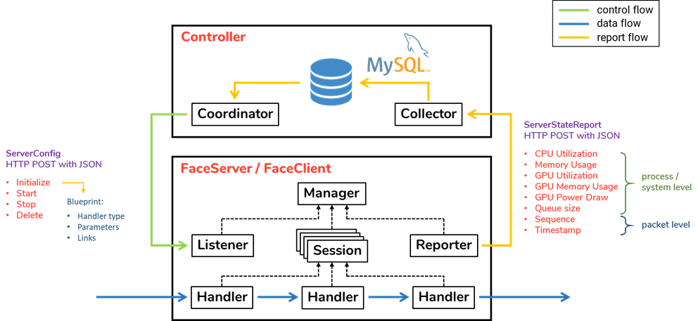

# Orchestrator

A centralized architecture to enable dynamic resource orchestration between computing nodes.

Face recognition or object detection services, each with different accuracy and processing time as well as different computing resource requirements, are broken into chains of handlers (or to say subprocess). Each handler could be placed on different nodes based on certain allocation algorithm on coordinator.

Data transmition between nodes is with HTTP.

## System Architecture



## Database

### Set-Up

```
# sudo ./install.sh
```

### Tables

sys_info: periodical records of compute node status.

<table>
  <tr>
    <td align=center><b>column</b></td>
    <td align=center><b>type</b></td>
    <td align=center><b>description</b></td>
  </tr>
  <tr>
    <td>timestamp</td>
    <td>FLOAT</td>
    <td>Sample time.</td>
  </tr>
  <tr>
    <td>node_ID</td>
    <td>INT</td>
    <td>Compute node ID.</td>
  </tr>
  <tr>
    <td>cpu_util</td>
    <td>FLOAT</td>
    <td>CPU utilization of compute node.</td>
  </tr>
  <tr>
    <td>mem_total</td>
    <td>INT</td>
    <td>Total memory of compute node.</td>
  </tr>
  <tr>
    <td>mem_util</td>
    <td>FLOAT</td>
    <td>Memory utilization of compute node.</td>
  </tr>
  <tr>
    <td>gpu_util</td>
    <td>INT</td>
    <td>GPU utilization of compute node.</td>
  </tr>
  <tr>
    <td>gpu_mem_util</td>
    <td>INT</td>
    <td>GPU memory utilization of compute node.</td>
  </tr>
  <tr>
    <td>gpu_clock</td>
    <td>INT</td>
    <td>GPU clock rate of compute node.</td>
  </tr>
  <tr>
    <td>gpu_power</td>
    <td>INT</td>
    <td>GPU consumed power of compute node.</td>
  </tr>
</table>

proc_info: periodical records of handler status.

<table>
  <tr>
    <td align=center><b>column</b></td>
    <td align=center><b>type</b></td>
    <td align=center><b>description</b></td>
  </tr>
  <tr>
    <td>timestamp</td>
    <td>FLOAT</td>
    <td>Sample time.</td>
  </tr>
  <tr>
    <td>session_ID</td>
    <td>INT</td>
    <td>Session ID.</td>
  </tr>
  <tr>
    <td>handler_ID</td>
    <td>INT</td>
    <td>Handler ID</td>
  </tr>
  <tr>
    <td>cpu_util</td>
    <td>FLOAT</td>
    <td>CPU utilization of handler.</td>
  </tr>
  <tr>
    <td>mem_util</td>
    <td>FLOAT</td>
    <td>Memory utilization of handler.</td>
  </tr>
  <tr>
    <td>gpu_util</td>
    <td>INT</td>
    <td>GPU utilization of handler.</td>
  </tr>
  <tr>
    <td>gpu_mem_util</td>
    <td>INT</td>
    <td>GPU memory utilization of handler.</td>
  </tr>
</table>

packet_info: records of packet event along with packet sequence number.

<table>
  <tr>
    <td align=center><b>column</b></td>
    <td align=center><b>type</b></td>
    <td align=center><b>description</b></td>
  </tr>
  <tr>
    <td>timestamp</td>
    <td>FLOAT</td>
    <td>Sample time.</td>
  </tr>
  <tr>
    <td>session_ID</td>
    <td>INT</td>
    <td>Session ID.</td>
  </tr>
  <tr>
    <td>handler_ID</td>
    <td>INT</td>
    <td>Handler ID</td>
  </tr>
  <tr>
    <td>sequence</td>
    <td>INT</td>
    <td>Sequence number of packet.</td>
  </tr>
  <tr>
    <td>event</td>
    <td>VARCHAR</td>
    <td>String indicating event type:
      <ul>
        <li>start:packet start processing.</li>
        <li>end:packet finished processing.</li>
        <li>sent: packet sent through network.</li>
        <li>recv:packet received from network.</li>
      </ul>
    </td>
  </tr>
</table>

## Coordinator

### Set-Up

```
# sudo ./install.sh
```

### Usage

```
# python3 main.py config/coordinator.conf
```

### Configurations

<table>
  <tr>
    <td colspan=2 align=center><b>coordinator</b></td>
  </tr>
  <tr>
    <td>node_path</td>
    <td>Directory includes compute node information and ID.</td>
  </tr>
  <tr>
    <td>handler_type_path</td>
    <td>Directory includes handler type information and ID (not used).</td>
  </tr>
  <tr>
    <td>service_type_path</td>
    <td>Directory includes service type information and ID.</td>
  </tr>
  <tr>
    <td colspan=2 align=center><b>database</b></td>
  </tr>
  <tr>
    <td>db_addr</td>
    <td>Address of database.</td>
  </tr>
  <tr>
    <td>db_port</td>
    <td>Listening port of database.</td>
  </tr>
  <tr>
    <td>db_user</td>
    <td>Login user name of database.</td>
  </tr>
  <tr>
    <td>db_passwd</td>
    <td>Login password of database</td>
  </tr>
  <tr>
    <td>db_schema</td>
    <td>Used schema of database.</td>
  </tr>
</table>

## Collector

### Set-Up

```
# sudo ./install.sh
```

### Usage

```
# python3 main.py config/collector.conf
```

### Configurations

<table>
  <tr>
    <td colspan=2 align=center><b>collector</b></td>
  </tr>
  <tr>
    <td>collector_addr</td>
    <td>Listening address of collector.</td>
  </tr>
  <tr>
    <td>collector_port</td>
    <td>Listening port of collector.</td>
  </tr>
  <tr>
    <td>node_path</td>
    <td>Directory includes compute node information and ID.</td>
  </tr>
  <tr>
    <td colspan=2 align=center><b>database</b></td>
  </tr>
  <tr>
    <td>db_addr</td>
    <td>Address of database.</td>
  </tr>
  <tr>
    <td>db_port</td>
    <td>Listening port of database.</td>
  </tr>
  <tr>
    <td>db_user</td>
    <td>Login user name of database.</td>
  </tr>
  <tr>
    <td>db_passwd</td>
    <td>Login password of database</td>
  </tr>
  <tr>
    <td>db_schema</td>
    <td>Used schema of database.</td>
  </tr>
</table>

## FaceServer

Please refers to [FaceServer](https://github.com/zasper32171/FaceServer)
